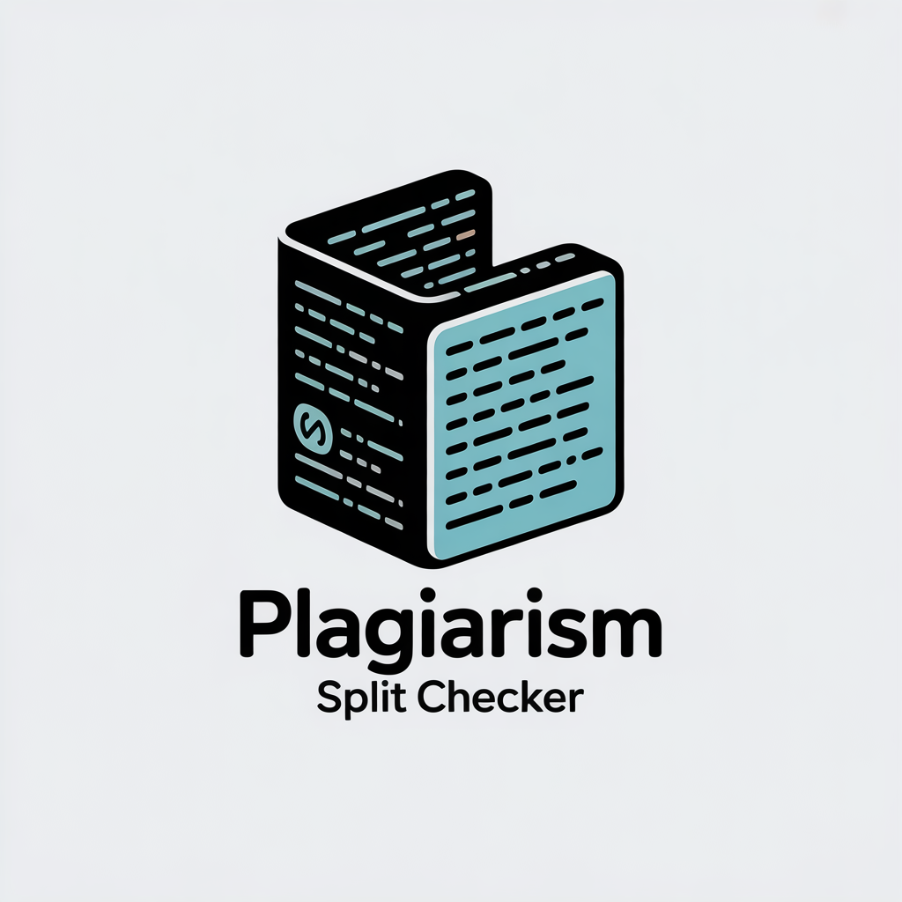

<div align="center">
  
  
  # Plagiarism Split Checker
  
  ### 📄 Split Large Documents • 🔍 Check Plagiarism • 📊 Calculate Accurate Results
  
  A powerful React application designed to help you check plagiarism on large documents by intelligently splitting them into manageable chunks and calculating weighted average results.
  
  [](https://reactjs.org/)
  [](LICENSE)
  [](src/utils)
</div>

---

## ✨ Features

- **📤 Multi-Format Support**: Upload `.txt`, `.docx`, or `.pdf` files
- **✂️ Smart Text Splitting**: Automatically splits documents into configurable word-count chunks (default: 1000 words)
- **📋 One-Click Copy**: Easily copy chunks to paste into plagiarism checkers
- **🧮 Weighted Calculations**: Accurately calculates final plagiarism percentage based on chunk sizes
- **🎯 Manual Checking**: Step-by-step wizard interface for manual plagiarism checking
- **🤖 Automatic Checking**: Infrastructure ready for API-based automatic checking (demo mode available)
- **🌙 Dark Mode**: Toggle between light and dark themes with persistent preferences
- **📄 PDF Export**: Export comprehensive plagiarism reports as PDF
- **🔗 Share Results**: Share results via Web Share API or clipboard
- **💾 Auto-Save**: Automatically saves progress to browser storage
- **📱 Responsive Design**: Works seamlessly on desktop, tablet, and mobile devices
- **⚡ Fast & Efficient**: Optimized performance with modern React
- **🧪 Fully Tested**: Comprehensive unit test coverage

## 🚀 Quick Start

### Prerequisites

- Node.js 14+ and npm installed on your system

### Installation

```bash
# Clone the repository
git clone https://github.com/rodneykeilson/plagiarism-split-checker.git

# Navigate to project directory
cd plagiarism-split-checker

# Install dependencies
npm install

# Start the development server
npm start
```

The app will open at [http://localhost:3000](http://localhost:3000)

## 📖 How to Use

1. **Upload Your Document** 
   - Drag & drop or click to select a `.txt`, `.docx`, or `.pdf` file

2. **Configure Chunk Size**
   - Default is 1000 words (matches most free plagiarism checkers)
   - Adjust based on your preferred checker's limits

3. **Copy & Check Chunks**
   - Use the "Copy to Clipboard" button for each chunk
   - Paste into your preferred plagiarism checker (e.g., [SmallSEOTools](https://smallseotools.com/plagiarism-checker/), [DupliChecker](https://www.duplichecker.com/))
   - Record the plagiarism percentage for each chunk

4. **Enter Results**
   - Input the plagiarism percentage for each chunk
   - Click "Calculate Final Plagiarism Percentage"

5. **Get Accurate Results**
   - The app calculates a weighted average based on chunk word counts
   - This ensures accurate results even with uneven chunk sizes
   - Export your report as PDF or share with others

## 🌙 Additional Features

### Dark Mode
Click the theme toggle button (🌙/☀️) in the top-right corner to switch between light and dark modes. Your preference is automatically saved.

### Export Results
After calculating the final plagiarism percentage, click **"📄 Export to PDF"** to download a comprehensive report including:
- Final weighted percentage
- Chunk-by-chunk breakdown
- Visual progress bars
- Timestamp and metadata

### Share Results
Click **"🔗 Share Results"** to:
- Share via native share dialog (mobile)
- Copy formatted results to clipboard (desktop)
- Share with colleagues or save for records

### Auto-Save Progress
Your work is automatically saved in browser storage. If you close the tab and return later, your progress will be restored automatically.

## 🧪 Testing

```bash
# Run all tests
npm test

# Run tests with coverage
npm test -- --coverage
```

All utility functions have comprehensive unit tests covering edge cases.

## 🚀 Deployment

### GitHub Pages (Recommended)

This project includes automated CI/CD via GitHub Actions:

```bash
# Just push to main branch
git push origin main
```

The pipeline will automatically:
1. ✅ Run all tests
2. ✅ Build for production
3. ✅ Deploy to GitHub Pages

**Setup:**
1. Enable GitHub Pages in repository settings
2. Select "GitHub Actions" as deployment source
3. Update `homepage` in `package.json` with your GitHub username
4. Push to main branch

Your site will be live at: `https://rodneykeilson.github.io/plagiarism-split-checker`

See [DEPLOYMENT.md](DEPLOYMENT.md) for detailed deployment instructions and alternatives (Vercel, Netlify).

### Manual Deployment

```bash
npm run deploy
```

## 🌟 Live Demo

[View Live Demo](https://rodneykeilson.github.io/plagiarism-split-checker)

## 🛠️ Technical Details

### Architecture

- **Frontend**: React 19 with Hooks
- **Build Tool**: Create React App with `react-app-rewired` for Node.js polyfills
- **File Processing**: 
  - `mammoth.js` for DOCX parsing
  - `pdfjs-dist` for PDF extraction
- **Testing**: Jest + React Testing Library

### Project Structure

```
src/
├── components/          # React components
│   ├── FileUploader.js
│   ├── TextSplitter.js
│   ├── ChunksList.js
│   ├── PlagiarismInputForm.js
│   ├── AutomaticChecker.js
│   ├── ThemeToggle.js
│   └── ErrorBoundary.js
├── contexts/           # React Context providers
│   ├── ThemeContext.js
│   └── ProgressContext.js
├── utils/              # Business logic utilities
│   ├── fileProcessing.js
│   ├── textSplitter.js
│   ├── plagiarismCalculator.js
│   ├── exportUtils.js
│   └── shareUtils.js
└── App.js             # Main application component
```

## 🎨 Features in Detail

### Wizard-Style Interface
- **4-Step Process**: Upload → Split → Check → Results
- **Progress Indicator**: Visual feedback on current step
- **Navigation**: Easy back/forward navigation between steps
- **Auto-Progress**: Automatically advances to next step when ready

### Export to PDF
- **Professional Reports**: Beautifully formatted PDF reports
- **Visual Charts**: Color-coded progress bars for each chunk
- **Metadata**: Includes timestamp and total statistics
- **Instant Download**: No server required, all client-side

### Dark Mode
- **Eye-Friendly**: Reduces eye strain in low-light environments
- **Persistent**: Remembers your preference across sessions
- **Smooth Transition**: Animated theme switching
- **Full Coverage**: All components support dark mode

### Browser Storage
- **Auto-Save**: Progress saved every time you make a change
- **Session Recovery**: Resume where you left off
- **Privacy-First**: All data stored locally in your browser
- **Clear Anytime**: Reset button clears all saved data

## 🤝 Contributing

Contributions are welcome! Please feel free to submit a Pull Request.

## 📄 Learn React

You can learn more in the [Create React App documentation](https://facebook.github.io/create-react-app/docs/getting-started).

To learn React, check out the [React documentation](https://reactjs.org/).

### Code Splitting

This section has moved here: [https://facebook.github.io/create-react-app/docs/code-splitting](https://facebook.github.io/create-react-app/docs/code-splitting)

### Analyzing the Bundle Size

This section has moved here: [https://facebook.github.io/create-react-app/docs/analyzing-the-bundle-size](https://facebook.github.io/create-react-app/docs/analyzing-the-bundle-size)

### Making a Progressive Web App

This section has moved here: [https://facebook.github.io/create-react-app/docs/making-a-progressive-web-app](https://facebook.github.io/create-react-app/docs/making-a-progressive-web-app)

### Advanced Configuration

This section has moved here: [https://facebook.github.io/create-react-app/docs/advanced-configuration](https://facebook.github.io/create-react-app/docs/advanced-configuration)

### Deployment

This section has moved here: [https://facebook.github.io/create-react-app/docs/deployment](https://facebook.github.io/create-react-app/docs/deployment)

### `npm run build` fails to minify

This section has moved here: [https://facebook.github.io/create-react-app/docs/troubleshooting#npm-run-build-fails-to-minify](https://facebook.github.io/create-react-app/docs/troubleshooting#npm-run-build-fails-to-minify)

# Plagiarism Split Checker

This application helps check plagiarism in large documents by splitting them into smaller chunks that can be processed by free plagiarism checking services.

## Features

- Upload and process .txt, .docx, and .pdf files
- Extract text content automatically
- Split text into chunks of customizable size (default: 1000 words)
- Easy copy-to-clipboard functionality for each chunk
- Calculate weighted average plagiarism percentage based on chunk size

## Automatic Checking (Experimental)

The application includes a demonstration of how automatic checking with services like DupliChecker could work. However, a complete implementation would require:

### Server-Side Implementation

To fully implement automatic checking with plagiarism services, you would need:

1. **Backend Server**: Create a Node.js, Python, or other server that can:
   - Receive text chunks from the frontend
   - Submit them to plagiarism checking services
   - Parse the results and return them to the frontend

2. **Web Scraping**: Use libraries like Puppeteer (Node.js) or Selenium (Python) to:
   - Navigate to the plagiarism checking service
   - Input the text content
   - Submit the form
   - Wait for results
   - Extract the plagiarism percentage from the page

3. **CAPTCHA Handling**: Many plagiarism services use CAPTCHA to prevent automation. Options include:
   - Manual CAPTCHA solving integration
   - CAPTCHA solving services (with ethical considerations)
   - Rate limiting your requests to avoid triggering CAPTCHA

4. **Rate Limiting & IP Rotation**: To avoid getting blocked:
   - Implement delays between requests
   - Potentially use IP rotation if necessary
   - Respect the website's robots.txt and terms of service

### Example Server Implementation (Conceptual)

```javascript
// Node.js example with Express and Puppeteer
const express = require('express');
const puppeteer = require('puppeteer');
const app = express();

app.use(express.json());

app.post('/check-plagiarism', async (req, res) => {
  const { text } = req.body;
  
  try {
    const result = await checkPlagiarism(text);
    res.json({ success: true, percentage: result });
  } catch (error) {
    res.json({ success: false, error: error.message });
  }
});

async function checkPlagiarism(text) {
  const browser = await puppeteer.launch();
  const page = await browser.newPage();
  
  try {
    // Navigate to DupliChecker
    await page.goto('https://www.duplichecker.com/');
    
    // Fill the text input
    await page.type('#textArea', text);
    
    // Click check button
    await page.click('#btnCheck');
    
    // Wait for results to load
    await page.waitForSelector('.result-text', { timeout: 60000 });
    
    // Extract percentage from the results page
    const percentage = await page.evaluate(() => {
      const resultText = document.querySelector('.result-text').innerText;
      const match = resultText.match(/(\d+(\.\d+)?)%/);
      return match ? parseFloat(match[1]) : 0;
    });
    
    return percentage;
  } finally {
    await browser.close();
  }
}

app.listen(3001, () => {
  console.log('Plagiarism checking server running on port 3001');
});
```

### Legal and Ethical Considerations

Before implementing automatic checking, consider:

- Review the Terms of Service of plagiarism checking websites
- Understand fair use policies and rate limiting
- Implement proper delays to avoid overloading the services
- Consider purchasing API access if the service offers it

## Getting Started

### Prerequisites

- Node.js and npm

### Installation

1. Clone the repository
2. Install dependencies
```bash
npm install
```
3. Start the application
```bash
npm start
```

## License

This project is licensed under the MIT License - see the LICENSE file for details.
