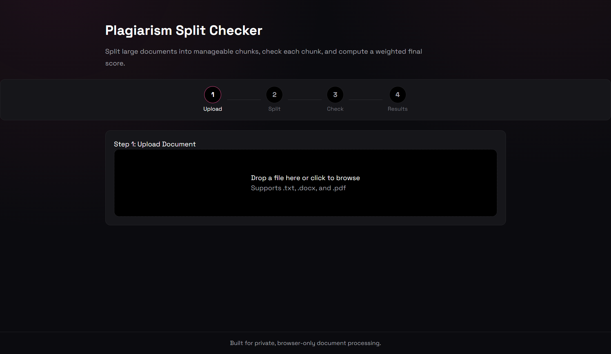

# Plagiarism Split Checker

Plagiarism Split Checker is a browser-first web app for splitting long documents into smaller chunks for plagiarism checks.

## Screenshot



## Project Summary

Plagiarism Split Checker | React, TypeScript, PDF.js, Tailwind CSS | 2025
- Built a web app that splits large PDF files into smaller text pieces for online plagiarism tools.
- Used PDF.js in the browser so users do not upload documents to a server.
- Designed a clean, simple UI focused on speed and readability.

## What It Does

- Accepts `.pdf`, `.docx`, and `.txt` files
- Extracts text in the browser
- Splits content by configurable word count
- Lets you copy chunks one by one
- Computes a weighted final plagiarism percentage
- Exports and shares the result summary
- Saves progress in local storage

## Privacy

Text extraction and chunking run in the browser. Files are not sent to your server by this app.

## Run Locally

```bash
git clone https://github.com/vewaxio/plagiarism-split-checker.git
cd plagiarism-split-checker
npm install
npm start
```

## Test

```bash
npm test -- --watchAll=false
```

## Deploy

Push to `main` to trigger GitHub Actions deployment.

Live site:
https://vewaxio.github.io/plagiarism-split-checker

## License

MIT
